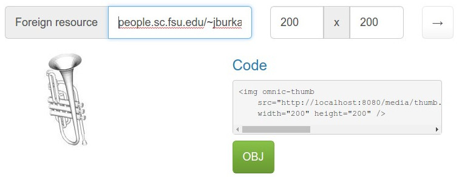
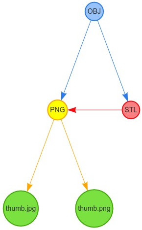

OmniC - Omni Converter
======================

.. figure:: https://travis-ci.org/michaelpb/omnic.svg?branch=master
   :alt: Travis CI

Mostly stateless microservice for generating on-the-fly thumbs and
previews of a wide variety of file types. Fully extendable to create any
arbitrary conversion pipelines.

Omni Converter (which can be shortened to OmniC or ``omnic``) is free
software, licensed under the GPL 3.0.

**WIP WARNING:** OmniC is still 'unreleased software', a work in progress. The
API is subject to rapid change. I intend to release the first stable version
before the end of this year (2017).

What is OmniC?
==============

OmniC is a lot of things. Most likely you will want it for making
visualizations and thumbnails of a wide variety of file types without needing
any (more) server-side code or database modifications.

On-the-fly conversions
----------------------

- OmniC is a web server that listens to requests like
  `http://omnic.mysite.com/media/thumb.png:200x200/?url=mysite.com/myimage.jpg`, and then it will
  download the `myimage.jpg` file, generate a 200x200 thumbnail of it, then
  respond with that thumbnail.

- It can also do filetype conversions like
  `/media/PDF/?url=mysite.com/mydoc.doc` for a PDF representation of a `.doc`
  file.

- OmniC doesn't do any of the conversions itself, instead it simply uses
  pre-made Linux visualizers and converters

Extensible conversion graph
---------------------------
- OmniC accomplishes these conversion via a Conversion Graph. In other words,
  you give it a file, and the desired type, and it will find path in the graph
  to get it there, even if it takes multiple conversions.

- In a few lines of code you can supply more converters (edges) in the
  conversion graph via an extensible framework, **extending it to any
  filetype** you need, or deactivating converters you don't need

Fast because of caching
-----------------------

- Since conversion can be a time-consuming process, every download and
  conversion step is cached for speed, so it only has to do it once.

- In production, it should sit behind an upstream cache or CDN,

- OmniC thus replaces the worker/queue/object-store formula with a stateless +
  caching formula, which is a much simpler topology, reducing scaling problems
  to load balancing problems

Replacing the build step
------------------------
- OmniC's concept of conversion is extremely broad and versatile: For example,
  it can build JS bundles from ES6 sources

- OmniC provides optional CLI tools to precache essential assets, to ensure
  even the first view after launching a site is correct

- Dependable file conversion made is easy: Use the provided Dockerfile to pull
  in every imaginable converter, with minor version numbers locked down

JavaScript framework
--------------------
- For best first-user experience and prevent connections from timing out, OmniC
  will initially serve up single transparent pixels in lieu of uncached
  thumbnails, but provides a tiny snippet of JavaScript to re-fetch it after
  its converted.

- OmniC also provides an optional JavaScript viewer system, hooked into its
  conversion system

- This allows the thumbnails to become interactive after a click: For example,
  a Word document might initially show a JPG thumbnail, then on click show a
  PDF-based viewer in a modal

Docker
======

This repo provides a (very bulky) Dockerfile for working with OmniC

1. Install and configure docker on your machine

2. Build the image: `docker build .`

3. Run the image: `docker run -it -p 127.0.0.1:8080:8080 <IMAGE HASH>`

4. Go to http://127.0.0.1:8080/ to see the deault "kitchen sink" OmniC server
in action

The Admin Interface
===================

OmniC comes bundled with a read-only admin interface. It's main purpose
is a sort of configuration sanity check, and queue monitoring, but it
also serves as a great demo.

::

    omnic runserver

Now point your browser at ``http://localhost:8080/admin/`` for the admin
interface.

From here you can paste in an URL to a resource, that OmniC will attempt
to display as a thumbnail. In this example an OBJ file (3D model format)
of a trumpet was pasted in, and a 200x200 thumbnail was generated:

   Admin interface screenshot

To the right of the thumbnail it has an HTML snippet (the source-code of
the thumbnail to the left), and a button that will take you to the
conversion graph for that type:

   Admin graph screenshot

Installing with pip
===================

If you want to run it outside of Docker, you can simply install it directly on
your machine, provided you have at least Python 3.5 installed.  The first step
is installing the Python package:

::

    pip install omnic

If you intend to run the webserver, you will need to install a few extra
dependencies:

::

    pip install sanic jinja2 uvloop

Contributing
============

Setting up a dev environment
----------------------------

1. Install Python 3, including ``pip`` and ``venv``:

   -  On Debian-based distros:

      -  ``sudo apt-get install python3 python3-env python3-pip``

   -  On macOS, use something like ``brew``

2. Create a virtualenv. For example:

   -  ``mkdir -p ~/.venvs/``
   -  ``python3 -m venv ~/.venvs/omnic``

3. Activate virtualenv:

   -  ``source ~/.venvs/omnic/bin/activate``
   -  You will need to do this any time you want to work

4. Install dependencies:

   -  ``pip install -r requirements.txt``

5. Run test suite, should have 150+ tests pass:

   -  ``py.test``

6. Start the server:

   -  ``./bin/omnic runserver``
